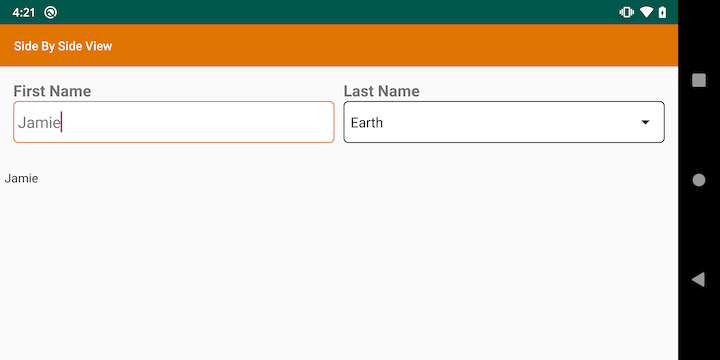
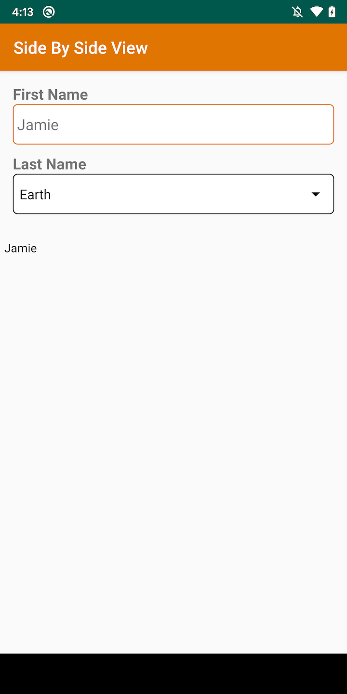

[](https://jitpack.io/#jampez77/sidebyside) [](http://www.repostatus.org/#active) [](https://GitHub.com/jampez77/sidebyside/stargazers) 

Side By Side View
=========================

This is a simple merged view to easily display two inputs with labels side  by side. When screen size is too small the view will move to a vertical alignment.





## Usage ##

```
dependencies {
    implementation 'com.github.jampez77:sidebyside:1.0.24'
}
```

Then in your activity's XML:

```xml
<LinearLayout xmlns:android="http://schemas.android.com/apk/res/android"
    xmlns:app="http://schemas.android.com/apk/res-auto"
    android:layout_width="match_parent"
    android:layout_height="match_parent"
    android:orientation="vertical">

    <com.jampez.sidebyside.SideBySideView
        android:id="@+id/names"
        android:layout_width="match_parent"
        android:layout_height="wrap_content"
        app:leftText="@string/first_name"
        app:rightText="@string/last_name"
        app:textAppearance="?android:attr/textAppearanceMedium"
        android:padding="5dp"
        android:layout_marginBottom="10dp"
        app:textViewTextStyle="bold"
        app:leftInput="EditText"
        app:rightSpinnerEntries="@array/planets_array"
        app:rightInput="Spinner"
        app:leftEditInputType="textPersonName"
        app:rightEditInputType="textPersonName"/>
            
</LinearLayout>
```

### Overview

The view is split into two views. They are laid out horizontally unless using a small screen, in which case they are laid out vertically. Each view has a label and an input. The inputs can be a `Spinner`, `Checkbox`, `EditText`, `Time` or `DateTime`.
Each input used has a corresponding listener this would be either `OnItemSelectedListener`, `OnCheckedChangeListener` or `TextWatcher` respectively. The listener used will return the String value of the input.

## Options

* leftText/rightText - text value for label and EditText hint
* textAppearance - set left and right text appearance 
* textViewTextStyle - set Typeface for left/right labels
* editTextTextStyle - set TypeFace for left/right EditTexts
* leftInput/rightInput - set input method
* leftEditInputType/rightEditInputType - set InputType for left/right EditTexts
* leftSpinnerEntries/rightSpinnerEntries - set left/right spinner items
* leftEditTextText/rightEditTextText - set left/right EditText Text
* leftEditTextHint/rightEditTextHint - set left/right EditText hint
* hideRightView - turn view into single input with label by hiding right side
* leftRequired/rightRequired - force input to be required for validation
* passwordValidationExpression - Regular expression for password validation
* passwordErrorMessage - Error message to display when password validation fails
* leftInputEnabled/rightInputEnabled - disable/enable input